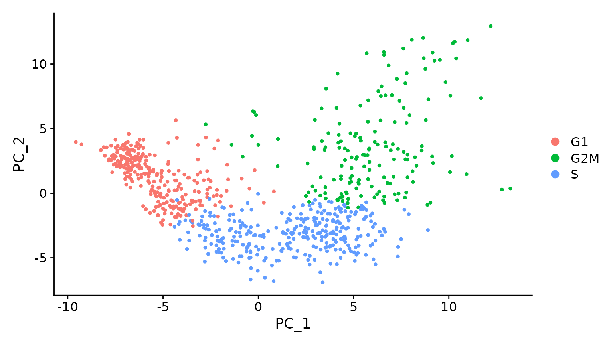

# Introduction

In session 1, we read in our single cell RNA-seq data and created a Seurat object in R. We then performed some quality control to assess for poor quality/empty cells, and subset the data according to the QC plots we generated. 

In this session, we are going to *normalise* the data, select the genes/features that are most variable between cells and scale the data,regressing out unwanted sources of variation. 

# Learning Objectives

* Learn the commands in Seurat to normalise, find variable features and scale our data

* Learn how to perform PCA on the data and why we do this

* Identify unwanted sources of variation in the data & find genes variable between cells

* Execute SCTransform to transform data and regress out unwanted variation (noise)

* Learn the commands in Seurat to integrate data & form clusters


# Sources of variation

Now that we have our high quality cells, there are still a few steps left before we can cluster cells by their expression profiles. 

Firstly, lets load in our data from the first session if we haven't got it already loaded.


```{r}
#Re-load libraries if needed
library(Seurat)
library(tidyverse)
```

```{r}
#Reload R objects if needed
filtered_data <- readRDS("Robjects/seurat_filtered_BACKUP.RDS")
```

Our end goal is to identify groups of cells that show interesting biological variation. However at the moment our data contains lots of potentially **unwanted variation** and **noise**. We have expression of many genes across many cells in multiple samples! This is an example of *high dimensional data*.

Sources of variation -
- Differences in sequencing depth (This is also common to bulk seq)
- Influential cell cycle genes can drive a lot of variation
- Poor quality cells (Hopefully we have removed these in the first session!)

# Normalisation

First of all we want to be able to compare gene expression between cells, do do this we need to normalise for sequencing depth. Currently each cell has a different number for `nCount_RNA` (the number of UMI).


```{r}
summary(filtered_data$nCount_RNA)
```

We can use the `NormalizeData` function to use log normalisation to take the sequencing depth into account. 

Briefly, this normalises the gene expression measurements for each cell by the total expression, multiplies this by a scale factor, and log-transforms the result. Now we can directly compare expression between cells.

```{r}
seurat_data <- NormalizeData(filtered_data)
```

# Find Variable Features

At this point we want to define the features or genes that are the **most variable** in our dataset. Ie, the genes that are showing most differences in expression within our dataset and are likely to be the most informative for defining clusters of cell types. 

Find features that define clusters, using the `FindVariableFeatures` function. Seurat does this by calculating a normalised intensity for each gene, then selecting the top 'n' most variable features, usually 2000. The samples contain PBMCs, so seeing immune-related genes in the top 20 is in line with what we would expect.

```{r}
# Identify the most variable genes
seurat_data <- FindVariableFeatures(seurat_data)

# Identify the top 20 most highly variable genes. We need the VariableFeatures function to pull the names
top20 <- head(VariableFeatures(seurat_data), 20)
top20


# Plot the variable features
VarPlot<- VariableFeaturePlot(seurat_data, )
LabelPoints(plot = VarPlot, points = top20, repel = TRUE)

```
# Scale

The next step is to scale the data which applies a linear transformation to the data that is a standard pre-processing step prior to dimensional reduction techniques like PCA. It stops highly expressed genes dominating the analysis.

```{r}
seurat_data <- ScaleData(seurat_data)
```


# PCA

As we mentioned earlier, the data is *high dimensional data*. This basically means we have many observations (cells) and many features(genes). This makes it impossible to discern patterns in expression to a human viewer! We need to use dimensional reduction techniques to increase the interpretability of the data - *without* losing too much meaningful information.

To do this we use a Principal Component Analysis or PCA. This breaks down multivariate data table as smaller set of variables or summary indices in order to observe patterns and outliers. It has many uses for interpreting multivariate data.

The good news is, this is a simple command to run.

```{r}
# Perform PCA
seurat_data <- RunPCA(seurat_data)
```

Lets have a look at how cthe two samples drives the observed variation in our PCA plot

```{r}
DimPlot(seurat_data , group.by = "orig.ident")
```

## Cell Cycle Genes

**Cell cycle genes** can often have strong effects within groups of cells and cause a lot of the inter cellular variation. This results with cells being clustered by their cell cycle stage instead of the cell type or condition.

To mitigate this, we can **identify** cell cycle stage by using known marker genes of the cell cycle and **regressing out** these effects.



Helpfully, the known cell phase marker genes from Tirosh et al, 2015 are included in Seurat by default.

```{r}
#Here they are!
cc.genes


s.genes <- cc.genes$s.genes
g2m.genes <- cc.genes$g2m.genes

# We also have this list saved if it hasn't loaded
# read.delim("regev_lab_cell_cycle_genes.txt")[,1]
```
<div class="information">

Other organisms phase genes can be found [here](https://github.com/hbc/tinyatlas/tree/master/cell_cycle)

</div>

We can now use the `CellCycleScoring` function in Seurat to 'score' or identify each cell's cell cycle phase based on the expression of these genes within that cell.

```{r}
seurat_data <- CellCycleScoring(seurat_data, 
                                 g2m.features = g2m.genes, 
                                 s.features = s.genes)

                              
seurat_data@meta.data %>% select(S.Score, G2M.Score, Phase)
```

We now have 3 new columns in our metadata. The highest score between S.Score and G2M.Score determines the phase. If both columns are negative, then the phase is G1. A bar plot shows us how many cells are in each phase. 

```{r}
as_tibble(seurat_data[[]]) %>% ggplot(aes(x = Phase, fill = Phase))+ geom_bar()
```
Lets have a look at how cell cycle phase drives the observed variation in our PCA plot

```{r}
DimPlot(seurat_data , group.by = "Phase")
```

## Mitochondrial genes 
Mitochondrial genes expression can also be a big contributer of variation. 

```{r}
# Catogorise the % of mitochondrial genes expressed in cells into low, medium and high
seurat_data$mito.cat <- cut(seurat_data$mito.ratio, breaks = 3, labels=c("Low","Medium", "High"))

DimPlot(seurat_data,  reduction = "pca",  group.by= "mito.cat")

```


# SCTransform

We decide to regress for mitochondrial ratio and cell-cycle status. We need to do this for each sample so first we split the object into a list of subsetted objects.

SCTransform is a newer addition to the Seurat package. It allows us to do the data normalisation, data scaling & finding of variable features in on simple step. 

It is a seperate and more statistically robust version of the steps we have done above. Importantly it allows us to regress out any sources of variation we have found in the above steps.


```{r message=FALSE}
seurat_split <- SplitObject(seurat_phase, split.by = "SampleName")

for(i in 1:length(seurat_split)){
  
  seurat_split[[i]] <- SCTransform(seurat_split[[i]],vars.to.regress = c("mito.ratio","nUMI","S.Score","G2M.Score") )
}

```

# Integration

Batch effect has not been addressed. This is potentially something that could be addressed within the SCTransform step we just performed, but regressing out assumes that the 'batch effect' is the same for all cells. As this is not normally the case, the seurat team developed a method specifically for dealing with this issue - integration. If our ultimate goal is to compare cell-type expression between groups, we'll need to integrate the data. If you go back to look at older single cell papers, you'll probably see that they haven't done this step, but it is now recognised to be more important. It is optional, but recommended. 

There are 4 steps for integration: 

1. Select variable features for integration by taking the highly variable genes from each sample identified using SCTransform above, we can specify here that we want to use the 3000 most variable genes for integration.

2. Prepare the SCTransform object for integration

3. Identify 'anchors' between cells. These are mutual nearest neighbours across the data. For each cell, the closest neighbour is identified based on gene expression. If the neighbour's closest neighbour is the original cell, these will be marked as 'anchors' for the data.

4. Integrate the conditions / samples by using the anchors along with their corresponding scores to transform cell expression values. 

```{r}
# Select variable features for integration
integ_features <- SelectIntegrationFeatures(object.list = seurat_split, nfeatures = 3000)

# Prepare the SCTransform object for integration
seurat_split <- PrepSCTIntegration(object.list = seurat_split, anchor.features = integ_features)
```

```{r}
# Identify mutual nearest neighbours across datasets
integ_anchors <- FindIntegrationAnchors(object.list = seurat_split, 
                                        normalization.method = "SCT",
                                        anchor.features = integ_features)

# Integrate across samples
seurat_integrated <- IntegrateData(anchorset = integ_anchors,normalization.method = "SCT")
```


Now we can run an analysis on the integrated object.

```{r}
# Run PCA, UMAP & TSNE
seurat_integrated <- RunPCA(object = seurat_integrated)
seurat_integrated <- RunTSNE(object = seurat_integrated)
seurat_integrated <- RunUMAP(object = seurat_integrated, dims = 1:30, verbose = FALSE) #Theres quite a lot of output for this command, if we don't want that, we can use the verbose = FALSE
```

<div class="exercise">
**Exercise:** It's a good idea to check what these clusters look like. Make a plot to examine the new PCA and UMAP for the new integrated object. Split the plot so there is 1 for each sample group. Then make another for cell phase.
</div>

We might want to check the numbers as well. We expect the majority of cell type clusters to be present in both samples, however depending on the experiment we might expect condition specific cell types instead.

```{r}
# Extract identity and sample information from seurat object to determine the number of cells per cluster per sample
n_cells <- FetchData(seurat_integrated, 
                     vars = c("ident", "orig.ident")) %>%
        dplyr::count(ident, orig.ident) %>%
        tidyr::spread(ident, n)

# View table
View(n_cells)
```


# Determine the 'dimensionality'

An elbow plot is a way to help determine how many PCs we should look at to ensure the majority of variation in the data is captured. The elbow plot helps to visualise the standard deviation of each PC. The location of the 'elbow bend' provides us with a good guess for how many PCs we should include. Let's plot the top 30 dimensions.

```{r}
# Plot the elbow plot
ElbowPlot(object = seurat_integrated, ndims = 30)
```

When we interpret the elbow plot, we use the 'elbow' to determine the point at which an extra PC is bringing diminishing returns and is no longer adding a meaningful reduction in standard deviation. As in this example, the precise elbow is not always easy to spot. We can also look at dimensionality heatmaps to give us another view. These show the PCA weightings for the highest and lowest weighted genes, against the genes most influenced by the PC. We interpret them by looking for a clear structure. Once that structure is lost, we're probably no longer adding useful information. If we plot the first 10, where we can see each PC is still adding information, we can see what they look like when they're informative.


```{r}
DimHeatmap(seurat_integrated, dims = 1:10, cells = 100, balanced = TRUE)
DimHeatmap(seurat_integrated, dims = 10:22, cells = 100, balanced = TRUE)
```

We can look at the most variable genes driving the PCA:

```{r}
print(x = seurat_integrated[["pca"]], 
      dims = 1:5, 
      nfeatures = 5)
```

Next we will explore additional metrics, such as the number of UMIs and genes per cell, S-phase and G2M-phase markers, and mitochondrial gene expression by UMAP. Looking at the individual S and G2M scores can give us additional information to checking the phase as we did previously.

```{r}
FeaturePlot(seurat_integrated, 
            reduction = "umap", 
            features = c("nUMI", "nGene", "S.Score", "G2M.Score"),
            pt.size = 0.4, 
            order = TRUE,
            min.cutoff = 'q10',
            label = TRUE)

```

# Find clusters

We decided from our Elbow plot how many dimensions to use in our clustering approach. We're going to do this in 2 steps. The first command is going to construct a K-nearest neighbour (KNN) graph using the `FindNeightbors()` function. Part of the input here is based on the elbow plot, where we've decided to use the top 21 dimensions. The second step is to use the `FindClusters()` function, which performs the actual clustering. The resolution argument here sets the 'granularity' for downstream clustering. A higher value results in more clusters. Seurat recommends picking a value between 0.4-1.2 for single cell sets ~3K cells. 


```{r}
seurat_integrated <- FindNeighbors(seurat_integrated, dims = 1:21, verbose = FALSE)
seurat_integrated <- FindClusters(seurat_integrated, verbose = FALSE, resolution = 0.5)
```

We can use the `DimPlot` function again to plot our new clusters. 

```{r}
DimPlot(seurat_integrated, label = TRUE) + NoLegend()
```

Save the Seurat data as an R object again.

```{r}
saveRDS(seurat_integrated, file = "Robjects/seurat_integrated.RDS")
```


