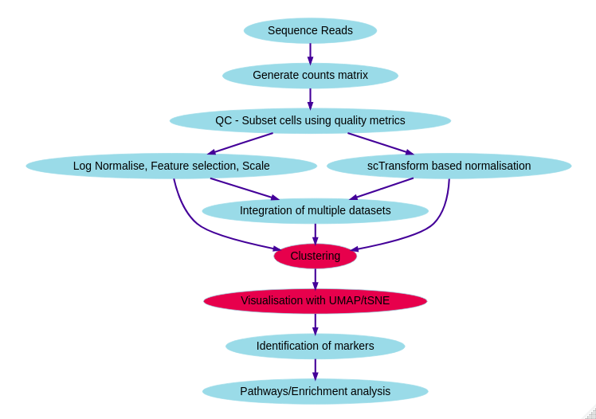

```{r setup, include=FALSE}
knitr::opts_chunk$set(
  tidy = TRUE,
  tidy.opts = list(width.cutoff = 95),
  message = FALSE,
  warning = FALSE,
  fig.width = 10,
  time_it = TRUE
)

```

# Introduction

To re-cap -  we have obtained our raw counts matrices from GEO (or cellranger). We have performed QC and subset the data according to the QC plots we generated. We have normalised the data, selected the most variable features and scaled - regressing out unwanted sources of variation. In the next past of the course we are going to explore differentially expressed genes between clusters and assigning cluster identitey. We will work through the following objectives.

* Find differentially expressed genes using `FindMarkers()` and `FindAllMarkers()`
* Find differentially expressed genes across leathy and disease cells within a cluster on interest
* Assign cluster identity using canonical marker genes
* Carry out a simple pathway analysis



Firstly, we will load up the two packages we have used previously.

```{r}
library(Seurat, quietly = T)
library(tidyverse, quietly = T)
```

And then we can load up the R objects we have used in the previous sessions.
```{r}
seurat <- readRDS("Robjects/seurat_integrated.RDS")
```

```{r, eval=FALSE, echo=F}
seurat <- RunPCA(object = seurat)
ElbowPlot(seurat)

seurat <- RunTSNE(object = seurat)
seurat <- RunUMAP(object = seurat, dims = 1:20)

seurat <- FindNeighbors(object = seurat, dims = 1:20)
seurat <- FindClusters(object = seurat, dims=1:20, resolution = 0.5)
```

```{r}
DimPlot(seurat, split.by = "Disease")
```


# Find differentially expressed genes

In Seurat we can find the top differentailly expressed genes, or markers, within each cluster. The function `FindMarkers()` handles most of the differential expression testing within the Seurat package and finds marker genes within a particular cluster. As a default, Seurat performs differential expression based on the non-parameteric Wilcoxon rank sum test but other methods are available within the function. 

To start with we can find all the markers in cluster 8. The min.pct argument requires a gene to be detected at a minimum percentage of cells.

```{r, echo=TRUE, results='hide'}

# We make sure the default assay is set back to "RNA" to use the original counts for DE analysis.
DefaultAssay(seurat) <- "RNA"
```


```{r}
cluster8.markers <- FindMarkers(seurat, ident.1 = 8, min.pct  = 0.25, verbose = F)
cluster8.markers %>% head
```


A little  bit of table manipulation makes the markers easier to view...

```{r, results='hide'}
cluster8.markers  %>% select(avg_log2FC, p_val, p_val_adj) %>%slice_max(n = 5, order_by = avg_log2FC)
```
To check our DE findings we can visualise expression of a particular gene of interest across all clusters using the `VlnPlot()` function. This shows expression of a gene (or genes) of interest across all clusters.

```{r}
VlnPlot(seurat, features = "IL32")
```
We can also check which cells express out gene of interest on the UMAP image

```{r}
FeaturePlot(seurat, features = "IL32")

```


Perhaps we are most interested in the differentially expressed genes between clusters 1 and 3

```{r}
cluster1.markers <- FindMarkers(seurat, ident.1 = 1, ident.2 = 3, min.pct = 0.25, verbose = F)
cluster1.markers %>% head()

# or the DE genes between clusters 1 and 3 and 4?

cluster1.markers <- FindMarkers(seurat, ident.1 = 1, ident.2 = c(3,4), min.pct = 0.25, verbose = F)
cluster1.markers %>% head()
```

Usually, we are wanting to find the most differentially expressed genes in each cluster across the whole dataset. For this we use `FindAllMarkers`. This time we will only report the positively expressed markers with a minimum log fold change of 0.25.

```{r}
markers <- FindAllMarkers(seurat, only.pos = TRUE, min.pct = 0.25, logfc.threshold = 0.25, verbose = F)

markers %>%
  select(gene, cluster, avg_log2FC, p_val, p_val_adj) %>%
    group_by(cluster) %>%
    slice_max(n = 5, order_by = avg_log2FC)
```

# Differentially expressed genes across conditions

We can investigate the differences in differentially expressed genes across conditions. To do this we need to make another column in our meta data which describes the cluster identity AND the disease condition.


```{r}
seurat$cluster_state <- paste(seurat$seurat_clusters, seurat$Disease, sep = "_")
Idents(seurat) <- "cluster_state"
```

If we take alook at the meta data we can see our new cluster/condition column

```{r}
seurat@meta.data %>% head()
```
Now we can look within a cluster and look at the most differentially expressed genes between each condition.

```{r}
cluster4.response <- FindMarkers(seurat, ident.1 = "4_Disease", ident.2 = "4_Healthy", verbose = FALSE)
cluster4.response %>%
    slice_max(n = 5, order_by = avg_log2FC)
```
Again, we can use a `VlnPlot` to visualise our findings. In this case we restict the plot to focus on our cluster of interest using our new cluster-state definitions

```{r}

VlnPlot(seurat, features = "TRAC", split.by = "cluster_state" , idents = c("4_Disease", "4_Healthy"))
```

# Assigning cluster identity

To assign biological meaning to our clusters, we are going to use canonical cell type markers from the paper. These genes are known to be expressed in a particular cell type.

Gene    Cell type
----    ----
CD34    CD79A B cells, 
MS4A1   CD20+ B cells, 
CST3    Monocytes, 
SPN   Immature hematopoietic, 
HBA1    erythrocytes, 
CD3D    T cells, 
NKG7    NK cells, 
MZB1    BCMA

We can assign these marker genes as a variable
```{r}
cell_markers <- c("CD34", "MS4A1", "CST3" ,"SPN", "HBA1", "CD3D", "NKG7", "GNLY",  "MZB1")
```

Dot plots allow us to examine particular features or genes of interest across all clusters. Creating a dotplot of the cell type markers lets us assign identity based on their expression.
```{r}
#Set idents back to clusters
Idents(seurat) <- "seurat_clusters"
DotPlot(seurat, features = cell_markers) + theme(axis.text.x = element_text(angle = 90, vjust = 0.5, hjust=1))
```
We can then manually create new identities for each cluster as follows.

```{r}
new.cluster.ids <- c("Variable", "Immature HPC", "B Cells + Erythrocytes", "BMCA", "Monocytes", "Cancer cells", "HPC", "T Cells + NK Cells", "B cells", "CD20+ B Cells")
names(new.cluster.ids) <- levels(seurat)
new.cluster.ids
seurat <- RenameIdents(seurat, new.cluster.ids)
```

```{r}
DimPlot(seurat, reduction = "umap", label = TRUE, pt.size = 0.5) + NoLegend()
```

# GO term and pathway enrichment


# Emily messing about below

```{r}

seurat2@meta.data
seurat2 <- readRDS("Robjects/seurat_filtered.RDS")
seurat2 <- SplitObject(seurat2, split.by = "orig.ident")
healthy <- seurat2[[2]]


healthy <- NormalizeData(object = healthy)
healthy <- FindVariableFeatures(object = healthy)
healthy <- ScaleData(object = healthy)
healthy <- RunPCA(object = healthy)
ElbowPlot(healthy)
healthy <- FindNeighbors(object = healthy, dims = 1:20)
healthy <- FindClusters(object = healthy, dim=0.4 )
healthy <- RunUMAP(healthy, dims = 1:20)
p1 <- DimPlot(healthy)
DotPlot(healthy, features = cell_markers) +theme(axis.text.x = element_text(angle = 90, vjust = 0.5, hjust=1))
```
```{r}
```{r}

seurat2@meta.data
seurat2 <- readRDS("Robjects/seurat_filtered.RDS")
seurat2 <- SplitObject(seurat2, split.by = "orig.ident")
disease<- seurat2[[1]]


disease <- NormalizeData(object = disease)
disease <- FindVariableFeatures(object = disease)
disease <- ScaleData(object = disease)
disease <- RunPCA(object = disease)
ElbowPlot(disease)
disease <- FindNeighbors(object = disease, dims = 1:20)
disease <- FindClusters(object = disease, dim=0.4 )
disease <- RunUMAP(disease, dims = 1:20)
p2 <- DimPlot(disease)
DotPlot(disease, features = cell_markers) +theme(axis.text.x = element_text(angle = 90, vjust = 0.5, hjust=1))
```

```{r}
gridExtra::grid.arrange(p1, p2)
```

```


```{r}

dbs <- c("GO_Molecular_Function_2015", "GO_Cellular_Component_2015", "GO_Biological_Process_2015")
DEenrichRPlot(
  seurat,
  ident.1 = "5_Disease",
  ident.2 = "5_Healthy",
  max.genes = 50,
  enrich.database = "GO_Biological_Process_2021"

)
```


```{r}
ggplot(seurat@meta.data, aes(x= seurat_clusters, fill=orig.ident)) + geom_bar(position = "fill")
```


