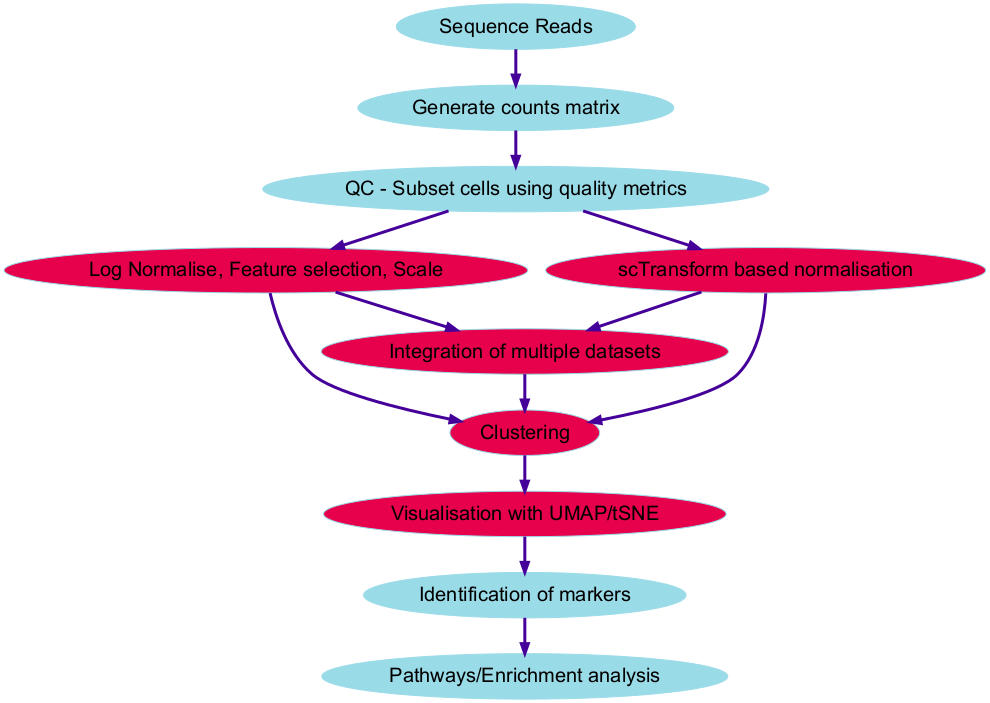

# Introduction

To re-cap -  we have obtained our raw counts matrices from GEO (or cellranger). We have performed QC and subset the data according to the QC plots we generated. We have normalised the data, selected the most variable features and scaled - regressing out unwanted sources of variation. The next step is to make biological sense ouf our clusters by identifying differentially expressed genes and assigning cell types. We can then carring out gene enrichment analysis and pathways analysis. 



Picture swiped from from https://hbctraining.github.io/In-depth-NGS-Data-Analysis-Course/sessionIV/lessons/SC_clustering_analysis.html

Firstly, we will load up the two packages we have used previously.

```{r, warning=FALSE}
library(Seurat, quietly = T)
library(tidyverse, quietly = T)
```

And then we can load up the R objects we have used in the previous sessions.
```{r}
seurat <- readRDS("Robjects/seurat_integrated.RDS")
```

```{r, eval=FALSE, echo=F}
seurat <- RunPCA(object = seurat)
seurat <- FindNeighbors(object = seurat)
seurat <- FindClusters(object = seurat)
seurat <- RunTSNE(object = seurat)
seurat <- RunUMAP(object = seurat, dims = 1:20)
```

```{r}
DimPlot(seurat, split.by = "Disease")
```


# Find differentially expressed genes

In Seurat we can find the top differentailly expressed genes, or markers, within each cluster. The function `FindMarkers()` handles most of the differential expression testing within the Seurat package and finds marker genes within a particular cluster. As a default, Seurat performs differential expression based on the non-parameteric Wilcoxon rank sum test but other methods are available within the function. 

To start with we can find all the markers in cluster 8. The min.pct argument requires a gene to be detected at a minimum percentage of cells.

```{r, echo=TRUE, results='hide'}

# We make sure the default assay is set back to "RNA" to use the original counts for DE analysis.
DefaultAssay(seurat) <- "RNA"


cluster8.markers <- FindMarkers(seurat, ident.1 = 8, min.pct  = 0.25)
cluster8.markers %>% head
```


A little  bit of table manipulation makes the markers easier to view...

```{r, results='hide'}
cluster8.markers  %>% select(avg_log2FC, p_val, p_val_adj) %>%slice_max(n = 5, order_by = avg_log2FC)
```
To check our DE findings we can visualise expression of a particular gene of interest across all clusters using the `VlnPlot()` function. This shows expression of a gene (or genes) of interest across all clusters.

```{r}
VlnPlot(seurat, features = "IL32")
```
We can also check whcih cells express out gene of interest on the UMAP image

```{r}
FeaturePlot(seurat, features = "IL32")

```


Perhaps we are most interested in the differentially expressed genes between clusters 1 and 3

```{r, results='hide'}
cluster1.markers <- FindMarkers(seurat, ident.1 = 1, ident.2 = 3, min.pct = 0.25)
cluster1.markers %>% head()

# or the DE genes between clusters 1 and 3 and 4?

cluster1.markers <- FindMarkers(seurat, ident.1 = 1, ident.2 = c(3,4), min.pct = 0.25)
cluster1.markers %>% head()
```

Usually, we are wanting to find the most differentially expressed genes in each cluster across the whole dataset. For this we use `FindAllMarkers`. This time we will only report the positively expressed markers with a minimum log fold change of 0.25.

```{r, results='hide'}
markers <- FindAllMarkers(seurat, only.pos = TRUE, min.pct = 0.25, logfc.threshold = 0.25)

markers %>%
  select(gene, cluster, avg_log2FC, p_val, p_val_adj) %>%
    group_by(cluster) %>%
    slice_max(n = 5, order_by = avg_log2FC)
```


# Find conserved markers across conditions

The function `FindConservedMarkers` allows us to identify canonical cell type marker genes that are conserved across conditions. This will be useful in our integrated dataset to find cell type markers that do not change across the condition (disease/normal)

```{r, results='hide'}

# We can check out metadata to make sure we know what variable our condition information is in. In this dataset it is 'Disease'

seurat@meta.data %>% head


conserved6_markers <- FindConservedMarkers(seurat, ident.1 = 6, grouping.var = "Disease", verbose = FALSE)
head(conserved6_markers)

```

```{r}
VlnPlot(seurat, features = "JUN", split.by = "Disease")
```


```{r}
seurat$cluster_state <- paste(seurat$seurat_clusters, seurat$Disease, sep = "_")
seurat$cluster_state %>% head()
Idents(seurat) <- "cluster_state"

unique(seurat$Disease)
seurat@meta.data

cluster5.response <- FindMarkers(seurat, ident.1 = "5_Disease", ident.2 = "5_Healthy", verbose = FALSE)
head(cluster5.response, n = 15)

```

```{r, fig.height=8}
FeaturePlot(seurat, features = c("LYZ", "S100A8", "IL32"), split.by = "Disease", max.cutoff = 3,
    cols = c("grey", "red"))
```


```{r}

dbs <- c("GO_Molecular_Function_2015", "GO_Cellular_Component_2015", "GO_Biological_Process_2015")
DEenrichRPlot(
  seurat,
  ident.1 = "5_Disease",
  ident.2 = "5_Healthy",
  max.genes = 50,
  enrich.database = "GO_Biological_Process_2021"

)
```


